<p align="center">
  <a href="#-parksense">
    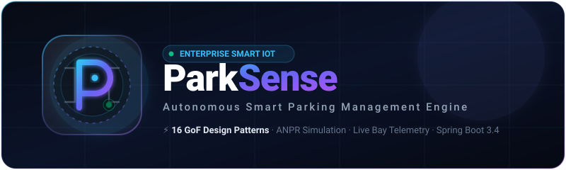
  </a>
</p>

<div align="center">

[](https://www.oracle.com/java/)
[](https://spring.io/projects/spring-boot)
[](https://www.mongodb.com/atlas)
[](#-the-16-design-patterns)
[-3ee6a0?style=for-the-badge&logo=checkmarx&logoColor=white)](#-test-suite--quality)
[](#-interface-showcase)

<p align="center">
  <b>Enterprise-Grade Smart Parking Management & Telemetry Engine</b><br>
  <i>A multi-tier smart parking ecosystem featuring ANPR gates, dynamic tariff algorithms, live bay occupancy telemetry, and hardware abstractions — architected with <b>16 Gang-of-Four (GoF) Design Patterns</b> under strict clean-architecture separation.</i>
</p>

<sub><b>CSE 463 : Software Design Pattern Make-up Assignment</b> · Summer 2026</sub>

<br><br>

[**🚀 Quick Start**](#-quick-start) &nbsp;•&nbsp;
[**📸 Interface Showcase**](#-interface-showcase) &nbsp;•&nbsp;
[**🏗️ Architecture**](#-system-architecture) &nbsp;•&nbsp;
[**🧩 16 GoF Patterns**](#-the-16-design-patterns) &nbsp;•&nbsp;
[**🎬 Live Demo Script**](#-live-demo-script) &nbsp;•&nbsp;
[**🔐 Security & RBAC**](#-roles--security)

</div>

---

## 🌟 Executive Summary

**ParkSense** simulates an autonomous, high-throughput smart parking facility across **3 floors and 132 monitored bays**. It integrates simulated automated number-plate recognition (ANPR) cameras, motorized barriers, ultrasonic bay sensors, variable-message LED boards, stacking tariff calculations, and role-guarded management consoles.

Every GoF pattern implemented is **load-bearing** — carrying actual runtime workflow responsibilities with zero cosmetic dead code and zero framework annotations polluting the core domain.

```
⚡ 132 Monitored Bays  |  ⚡ 16 GoF Patterns  |  ⚡ 91 Unit/Integration Tests  |  ⚡ 0 External UI Dependencies
```

---

## 📸 Interface Showcase

<div align="center">

| 🗺️ **Live Bay-Level Slot Map** | 🚧 **ANPR Gate Simulator** |
|:---:|:---:|
| 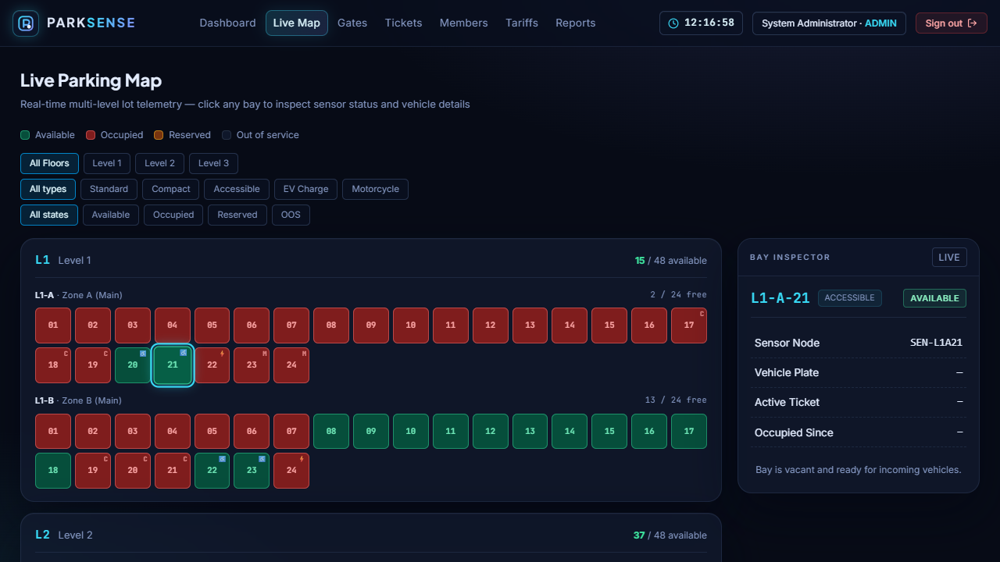 | 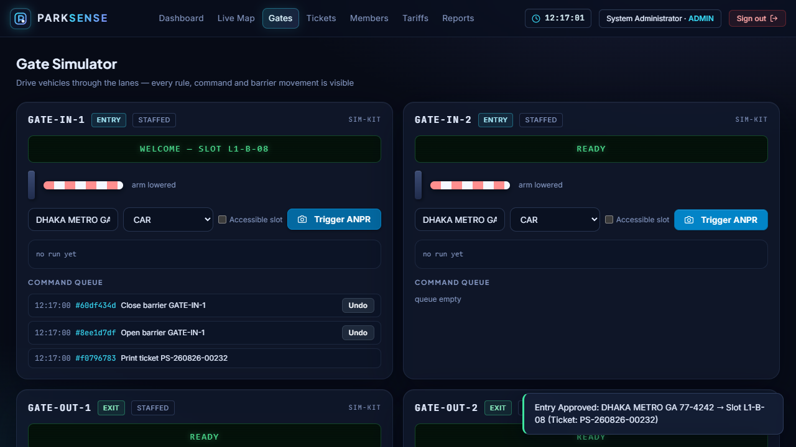 |
| *Real-time bay occupancy, EV status, and inspector modal* | *ANPR camera trigger, barrier commands, & chain-of-rule verdict* |

| 📊 **Real-time Control Room KPI** | 🧩 **Live Pattern Catalogue (`dev`)** |
|:---:|:---:|
| 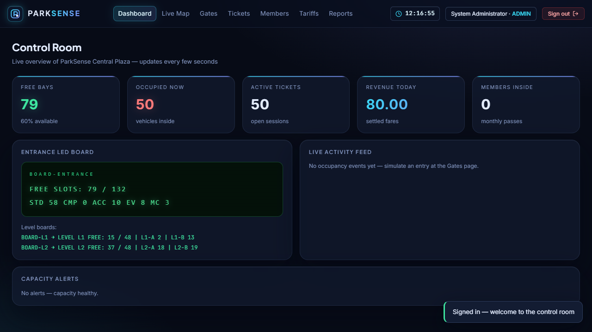 | 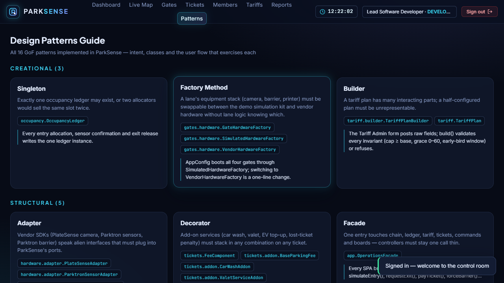 |
| *Count-up telemetry tiles, occupancy rate, & live event stream* | *In-app reflection showing all 16 active patterns in runtime code* |

</div>

<details>
<summary><b>🔍 View More Screens (Checkout, Receipts, Members, Tariff Admin)</b></summary>
<br>

| Screen | Preview |
|---|---|
| **Settlement & Fee Stacking** | 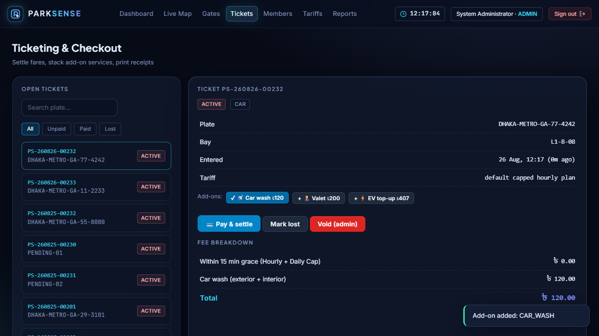 |
| **Audit Receipt Generation** | 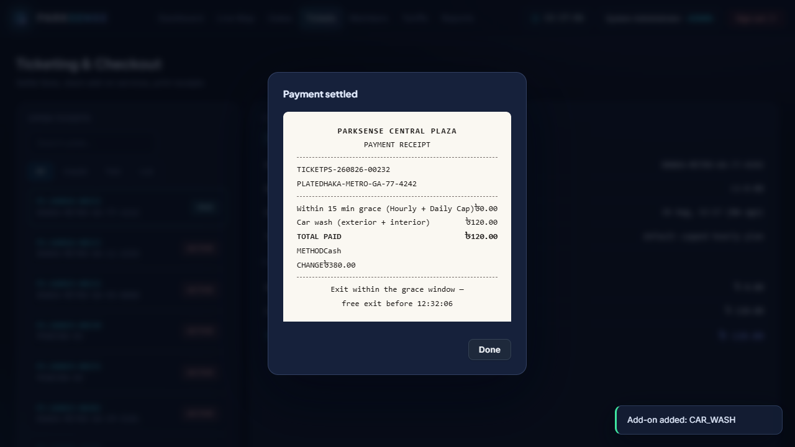 |
| **Pass Registry & Members** | 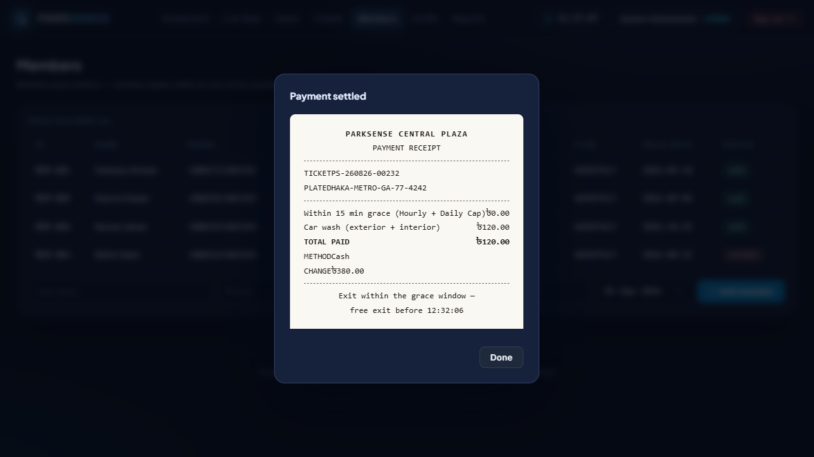 |
| **Tariff Strategy Manager** | 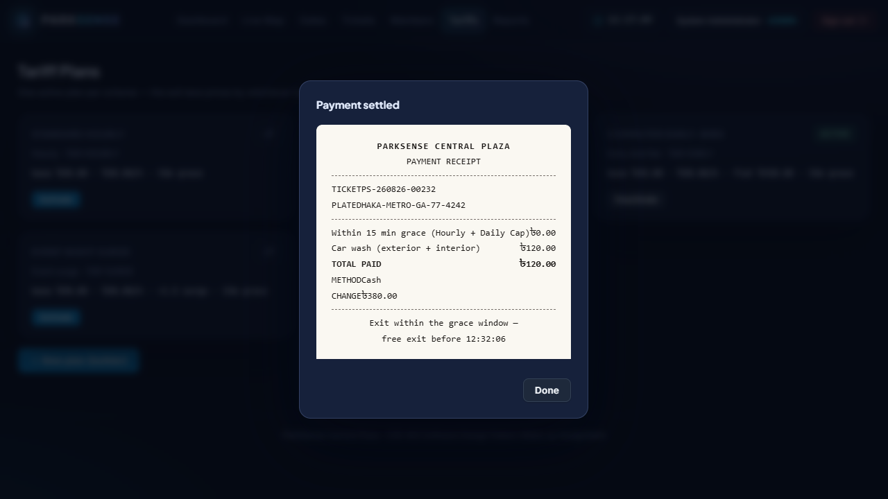 |
| **Business Analytics & CSV** | 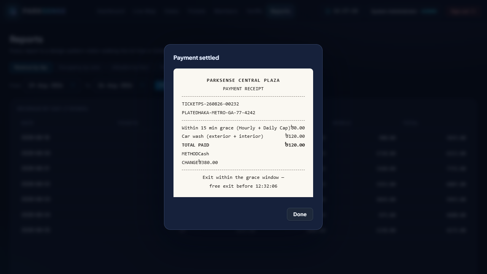 |

</details>

---

## 🏗️ System Architecture

ParkSense enforces strict separation of concerns. Spring Boot 3.4 is constrained purely to HTTP entrypoints and configuration bootstrapping; the underlying business logic remains pure, uncoupled, testable Java 17.

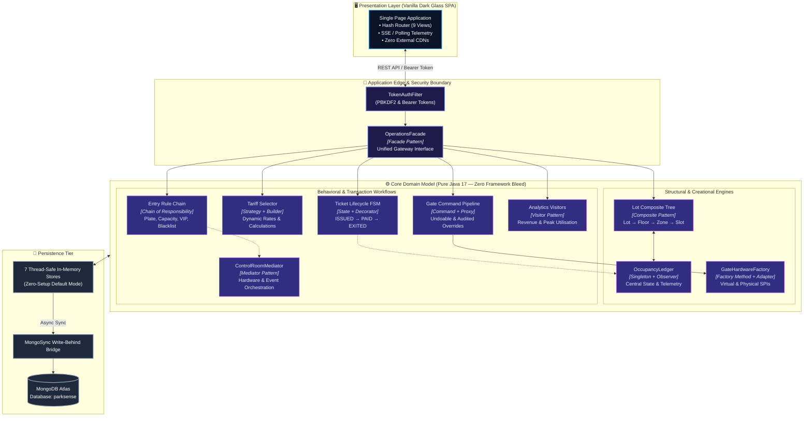

---

## 🧩 The 16 Design Patterns

Every pattern is directly accessible and observable in real-time execution:

| Category | # | Pattern | Key Concrete Class | Concrete System Responsibility |
|:---:|:---:|---|---|---|
| **Creational** | 1 | **Singleton** | [`OccupancyLedger`](src/main/java/com/parksense/occupancy/OccupancyLedger.java) | Ensures a single authoritative source of truth for parking bay state across all threads. |
| | 2 | **Factory Method** | [`GateHardwareFactory`](src/main/java/com/parksense/hardware/hardware/GateHardwareFactory.java) | Creates decoupled hardware driver families (`Simulated` vs `VendorPhysical`). |
| | 3 | **Builder** | [`TariffPlanBuilder`](src/main/java/com/parksense/tariff/builder/TariffPlanBuilder.java) | Enforces fluent, validated construction of intricate multi-rate tariff policies. |
| **Structural** | 4 | **Adapter** | [`PlateSenseAnprAdapter`](src/main/java/com/parksense/hardware/adapter/PlateSenseAnprAdapter.java) | Translates third-party ANPR camera & loop detector SPIs into internal domain events. |
| | 5 | **Decorator** | [`CarWashDecorator`](src/main/java/com/parksense/tickets/addon/CarWashDecorator.java) | Dynamically wraps ticket instances to append modular fee line-items (EV charge, Valet). |
| | 6 | **Facade** | [`OperationsFacade`](src/main/java/com/parksense/app/OperationsFacade.java) | Consolidates complex subsystem interactions into clean, single-call business operations. |
| | 7 | **Proxy** | [`GateControlProxy`](src/main/java/com/parksense/gates/guard/GateControlProxy.java) | Intercepts barrier overrides to enforce RBAC permissions and log immutable audit trails. |
| | 8 | **Composite** | [`ParkingLotComponent`](src/main/java/com/parksense/lot/ParkingLotComponent.java) | Treats hierarchical parking structures (`Lot` → `Floor` → `Zone` → `Slot`) uniformly. |
| **Behavioral** | 9 | **Mediator** | [`ControlRoomMediator`](src/main/java/com/parksense/controlroom/ControlRoomMediator.java) | Decouples direct communications between barriers, ANPR kiosks, LED boards, and alerts. |
| | 10 | **Observer** | [`LedgerSubject`](src/main/java/com/parksense/occupancy/LedgerSubject.java) | Broadcasts real-time occupancy updates to overhead LED signs and live UI feeds. |
| | 11 | **Strategy** | [`TariffStrategy`](src/main/java/com/parksense/tariff/strategy/TariffStrategy.java) | Encapsulates interchangeable pricing logic (Hourly, Early Bird, Surge, Member Pass). |
| | 12 | **Command** | [`OpenBarrierCommand`](src/main/java/com/parksense/gates/command/OpenBarrierCommand.java) | Encapsulates barrier operations into queueable, logged, and undoable objects. |
| | 13 | **Template Method** | [`ExitProcessor`](src/main/java/com/parksense/exitlane/ExitProcessor.java) | Defines standard vehicle checkout skeleton while letting Express & Staffed lanes specialize steps. |
| | 14 | **Chain of Responsibility** | [`EntryRule`](src/main/java/com/parksense/entrycheck/EntryRule.java) | Pipes vehicle entry through ordered validation checks (Blacklist → Type → Capacity). |
| | 15 | **State** | [`TicketState`](src/main/java/com/parksense/tickets/state/TicketState.java) | Governs ticket lifecycle transitions (`ISSUED` → `ACTIVE` → `PAID` → `EXITED`). |
| | 16 | **Visitor** | [`LotVisitor`](src/main/java/com/parksense/reports/visitor/LotVisitor.java) | Traverses parking data structures to compute revenue summaries and utilisation metrics. |

> 💡 *Tip:* Sign in as user `dev` to inspect the live interactive Pattern Catalogue directly within the app (`GET /api/system/patterns`).

---

## 🚀 Quick Start

### Prerequisites
* **Java Development Kit (JDK) 17+**
* No external database or node server required (zero-setup in-memory fallback enabled by default).

### 1. Run Application
```powershell
# Clone the repository
git clone https://github.com/MHMITHUN/ParkSense-Smart-Parking-System.git
cd ParkSense-Smart-Parking-System

# Launch via Maven Wrapper (Windows)
.\mvnw.cmd spring-boot:run

# Launch via Maven Wrapper (Linux / macOS)
./mvnw spring-boot:run
```

Once started, navigate to **`http://localhost:8080`** in your browser.

---

### 2. Optional: Enable Cloud Persistence (MongoDB Atlas)

To preserve parking state, tickets, revenue audits, and tariffs across restarts:

1. Copy `.env.example` to `.env`:
   ```bash
   cp .env.example .env
   ```
2. Set your MongoDB Atlas connection string in `.env`:
   ```ini
   MONGODB_URI=mongodb+srv://<USER>:<PASSWORD>@<CLUSTER>.mongodb.net/?appName=ParkSense
   MONGODB_DB=parksense
   ```
*(If unreachable, ParkSense gracefully falls back to in-memory mode without interrupting the application).*

---

## 🔑 Default Credentials & Role Matrix

The system boots with pre-seeded test accounts, 132 slots (~35% occupied), 4 registered members, blacklisted vehicles, and sample historical transactions:

| Role | Username | Password | Access Capabilities |
|:---:|:---:|:---:|---|
| **ADMIN** | `admin` | `admin123` | Full access: Tariff builder, barrier emergency override, voids, full audit logs. |
| **OPERATOR** | `operator` | `operator123` | Operational access: Entry/exit lane controls, ticket settlement, receipt printing. |
| **DEVELOPER** | `dev` | `dev123` | Full administrative access **+ Live Design Pattern Catalogue Tab**. |

---

## 🎬 Live Demo Script

Follow these steps to experience the design patterns in action:

1. **Gate Ingress (`Chain of Responsibility` & `Mediator`)**:
   * Navigate to **Gates** → Select **GATE-IN-1** → Click **Trigger ANPR**.
   * Observe the 6-rule validation pass, the animated barrier lift, the queued command, and the real-time slot map turning occupied.
2. **Security Interception (`Chain of Responsibility`)**:
   * Trigger ANPR with blacklisted plate **`STOLEN-01`**.
   * Observe instant refusal on the lane HUD with reason: `VEHICLE BLACKLISTED`.
3. **Add-on Stacking & Payment (`Decorator` & `State`)**:
   * Go to **Tickets** → Select the active ticket → Add **EV Charging** and **Car Wash** add-ons.
   * Observe dynamically calculated fee lines and transition to `PAID` state with a 15-minute exit grace timer.
4. **Security Proxy Interception (`Proxy Pattern`)**:
   * Log in as `operator` and attempt **Emergency Force Open** on a barrier.
   * The protection proxy will block the action with **HTTP 403 Forbidden** and write a violation to the immutable audit trail.
5. **Visitor Pattern Reporting (`Visitor Pattern`)**:
   * Open **Reports** to inspect revenue breakdown, peak hour histograms, and export reports to CSV.

---

## 🧪 Test Suite & Quality

The codebase includes an extensive automated test suite covering state transitions, rule chains, tariff edge-cases, and mock hardware concurrency:

```powershell
# Execute complete unit & integration test suite
.\mvnw.cmd clean test
```

```text
[INFO] -------------------------------------------------------
[INFO]  T E S T S
[INFO] -------------------------------------------------------
[INFO] Running com.parksense.tariff.TariffStrategyTest
[INFO] Tests run: 14, Failures: 0, Errors: 0, Skipped: 0
[INFO] Running com.parksense.entrycheck.EntryChainTest
[INFO] Tests run: 12, Failures: 0, Errors: 0, Skipped: 0
[INFO] Running com.parksense.tickets.TicketStateTest
[INFO] Tests run: 18, Failures: 0, Errors: 0, Skipped: 0
...
[INFO] Results:
[INFO] Tests run: 91, Failures: 0, Errors: 0, Skipped: 0
[INFO] -------------------------------------------------------
[INFO] BUILD SUCCESS
```

---

## 🔐 Security & Reliability Highlights

* **Password Hashing:** `PBKDF2WithHmacSHA256` with 120,000 iterations and cryptographic per-user salting.
* **Token Authentication:** Secure random 256-bit bearer tokens validated through thread-local security context.
* **Financial Accuracy:** All financial calculations strictly utilize `java.math.BigDecimal` (BDT currency, 2 decimal places) to eliminate IEEE 754 floating-point drift.
* **Auditability:** Append-only log recording all barrier overrides, security denials, payment settlements, and voids.

---

## 📂 Repository Layout

```
ParkSense/
├── 📄 ParkSense-Report.tex        # Comprehensive LaTeX project report (BUBT format)
├── 🖼️ figs/                       # UI screenshots, vector graphics & system branding
├── 📊 diagrams/                   # 17 formal architectural & UML diagram renders
└── 📦 src/
    ├── main/java/com/parksense/
    │   ├── app/                   # Bootstrapping, Seed Data, OperationsFacade (Facade)
    │   ├── lot/                   # Parking composite hierarchy (Composite)
    │   ├── occupancy/             # Central state ledger (Singleton, Observer)
    │   ├── controlroom/           # Orchestrating mediator (Mediator)
    │   ├── gates/                 # Hardware commands, proxy barriers (Command, Proxy)
    │   ├── hardware/              # Hardware SPIs, vendors, adapters (Adapter, Factory)
    │   ├── entrycheck/            # Six-stage entry rule validation (Chain of Resp.)
    │   ├── exitlane/              # Vehicle exit workflow processing (Template Method)
    │   ├── tickets/               # Ticket lifecycle & fee stacking (State, Decorator)
    │   ├── tariff/                # Calculation engines & plan builder (Strategy, Builder)
    │   ├── members/               # Registered pass-holder registry
    │   ├── reports/               # Data analytics & CSV generators (Visitor)
    │   ├── persistence/           # Asynchronous MongoDB write-behind bridge
    │   ├── auth/                  # RBAC, PBKDF2 encryption, session tokens
    │   ├── audit/                 # Append-only compliance audit trail
    │   └── api/                   # REST controller endpoints & DTOs
    └── main/resources/static/     # Zero-dependency vanilla Dark-Glass SPA
```

---

<div align="center">

### 🎓 Academic Citation

```bibtex
@project{parksense2026,
  title   = {ParkSense: Enterprise Smart Parking Management System},
  author  = {MD. MAHAMUDUL HASAN MITHUN},
  course  = {CSE 463: Software Design Pattern},
  year    = {2026},
  school  = {BUBT}
}
```

<sub>Crafted with precision for <b>CSE 463 Software Design Pattern Make-up Assignment</b> (Summer 2026).</sub><br>
<sub><i>Every pattern load-bearing. Every rule visible. Every override audited.</i> 🅿️</sub>

</div>
